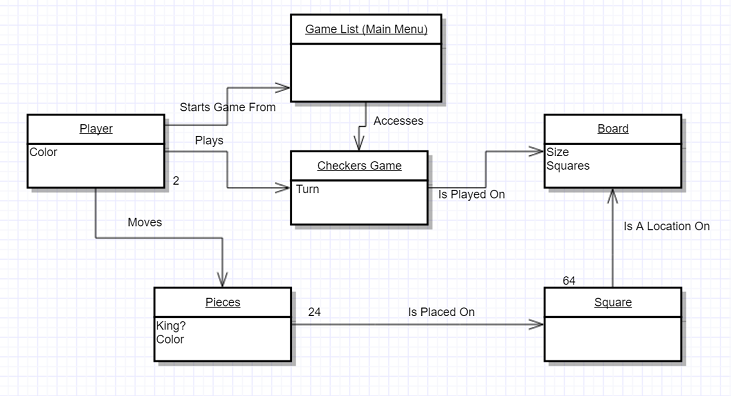
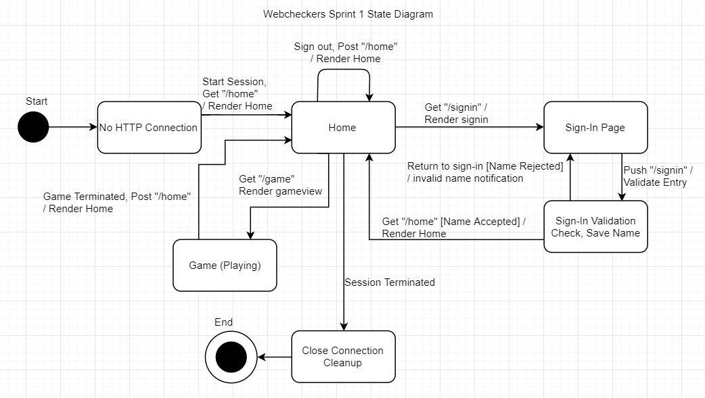

---
geometry: margin=1in
---
# WebCheckers Design Documentation 
<!-- Title Page - how? -->

<!--- The following template provides the headings for your Design Documentation.  As you edit each section make sure you remove these commentary 'blockquotes'; the lines that start with a > character.
-->

<!-- MODIFICATION LOG!!!!!!!!!!!!!!!!!!!!!!!!!!!!!!!!!!!!!! -->

# Team Information
* Team name: TheAdoptedFive
* Team members
  * Daniel Harrington
  * Josh Abrams
  * Thomas Morris
  * Varnit Tewari
  * Vincent Li

## Executive Summary
The project is a multi-player web application of Checkers game. The application has a sign in page for every player after which the player can choose from a lobby who he or she wants to play the game of checkers against. After getting matched up with a player, the initial board of checkers is provided where players can play the game.

### Purpose
This application allows you to play the game of American Checkers online so that the players don't have to physically meetup to play.

### Glossary and Acronyms
<!--- Provide a table of terms and acronyms. -->

| Term | Definition |
|------|------------|
| MVP | Minimum Viable Product |
| AI | Artificial Intelligence |
| HTTP | HyperText Transfer Protocol |
| HTML | HyperText Markup Language |

## Requirements
This section describes the features of the application.

*Nonfunctional*

The project is required to be developed using Java 8 and Jetty(a Java-based server), which will allow it to be available at the URL, localhost:4567, when the server is running. Maven is a build tool for Java apps and is used to handle the dependencies for the project. The Spark  Web micro framework and Free Marker template engine must be used to route the HTTP requests and create HTML responses.
  Regarding extensibility, the project must be able to have possible enhancements added to it to improve the checkers players’ user experience. In addition, the acceptance criteria be able to be tested by other developers on the team and will only be tested by team members. It is not required to persist data across the web app shutdown and start.

*Functional*

* A player must be able to sign in with a unique player name and once signed in, is able to sign out from any page.
* Player/s must be able to play a game of checkers that follows the American rules using drag-and-drop actions.
* A player must be able to select which games they want to play according to their color preferences.
* A player must be able to resign from a checkers game at anytime, which will cause the game to end.

### Definition of MVP
A minimum viable product (MVP) is a development technique in which a new product or website is developed with sufficient features to satisfy early adopters. Therefore, the final, complete set of features for checkers game is only designed and developed after considering the customer requirements. The MVP for the product will allow two players to play a game of checkers with their own accounts.

### MVP Features
1. Every player must sign-in before playing a game, and be able to sign-out when finished playing.
2. Two players must be able to play a game of checkers based upon the American rules.
3. Either player of a game may choose to resign, at any point, which ends the game.

### Roadmap of Enhancements
<!--- Provide a list of top-level features in the order you plan to consider them. -->
1. Spectator Mode: Other players may view an on-going game that they are not playing.
2. Player Help: Extend the Game View to support the ability to request help.
3. Tournament Play: Players can enter into checkers tournaments including player statistics.
4. AI Player: Players may play a game against an artificial intelligence player.
5. Asynchronous Play: Players can play asynchronously.
6. Multiple Games: A player may play more than one game at a time.
7. Replay Mode: Games can be stored and then replayed at a later date.

## Application Domain

This section describes the application domain.

The domain area is an American game of checkers. It consists of two players playing on an 8*8 board with 12 checkers pieces, either red or black, each. The objective of the game is to stop the opponent from moving or having them forfeit. Players can capture pieces by jumping over them and gain an advantage by capturing their pieces. They can choose which color they want to start with, since whoever is red makes the first move. Pieces only move diagonally on the black squares and must make a capture if it is possible. The game ends when one player has all their pieces captured, they cannot make any moves, or they choose to resign from the game.

## Architecture

This section describes the application architecture.

### Summary

The following Tiers/Layers model shows a high-level view of the webapp's architecture.

As a web application, the user interacts with the system using a browser.  The client-side
of the UI is composed of HTML pages with some minimal CSS for styling the page.  There is also
some JavaScript that has been provided to the team by the architect.

The server-side tiers include the UI Tier that is composed of UI Controllers and Views.
Controllers are built using the Spark framework and View are built using the FreeMarker framework.  The Application and Model tiers are built using plain-old Java objects (POJOs).

Details of the components within these tiers are supplied below

### Overview of User Interface

This section describes the web interface flow; this is how the user views and interacts
with the WebCheckers application.

As seen from the diagram, there are three rendered web pages Home, Sign-in and Game. Home page can be reached from all of the three above if a certain action is taken. A player can only access the Game and Sign-in pages once they have passed the Home page. The Home page's contents depend on the sign-in state of the player, with added functionality rendered when returning to home as a signed-in player. This includes the options to start games, which renders the gameview. The Home page represents the central location of user interaction, where all actions are ultimately being initiated from and returning to Home until the session is terminated. 

### UI Tier
<!---  Provide a summary of the Server-side UI tier of your architecture.
> Describe the types of components in the tier and describe their responsibilities. -->

#### Static models
<!--- > Provide one or more static models (UML class or object diagrams) with some details such as critical attributes and methods. -->

#### Dynamic models
<!--- > Provide any dynamic models, such as state and sequence diagrams, as is relevant to a particularly significant user story.
> For example, in WebCheckers you might create a sequence diagram of the `POST /validateMove` HTTP request processing or you might use a state diagram if the Game component uses a state machine to manage the game. -->

### Application Tier
<!--- > Provide a summary of the Application tier of your architecture.
> Describe the types of components in the tier and describe their responsibilities. -->

#### Static models
<!--- > Provide one or more static models (UML class or object diagrams) with some details such as critical attributes and methods. -->

#### Dynamic models
<!--- > Provide any dynamic model, such as state and sequence diagrams, as is relevant to a particularly significant user story. -->

### Model Tier
<!--- > Provide a summary of the Model tier of your architecture.
> Describe the types of components in the tier and describe their responsibilities. -->

#### Static models
<!--- > Provide one or more static models (UML class or object diagrams) with some details such as critical attributes and methods. -->

#### Dynamic models
<!--- > Provide any dynamic model, such as state and sequence diagrams, as is relevant to a particularly significant user story. -->

<!-- Subsystems? PlayerLobby, etc? Follow above layout. -->